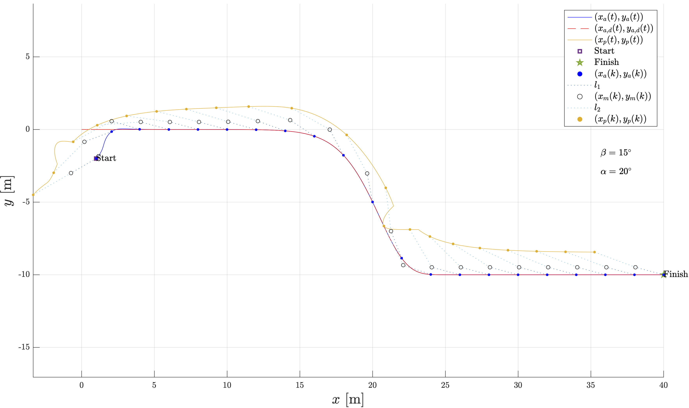

# Feedback Linearization Control of an Articulated Vehicle

The project aims to analyze the structural properties and implement feedback linearization control of an articulated vehicle.

	<a href="#prerequisite">Prerequisite</a>
	 • 
	<a href="use">Use</a>
	 • 
	<a href="doc/presentation.pdf">Presentation</a>
	 • 
	<a href="#sample-images">Sample Images</a>

## Overview
The repository includes the following:

* The vehicle model and its kinematic equations
* Analysis of the structural properties such as accessibility, controllability, and observability
* Implementation of feedback linearization control and simulation of the system
* Simulink diagram of the system
* Sigmoid and circumference functions used in the simulation

## Feedback Linearization Control
Feedback Linearization is a technique used in control theory to convert a nonlinear dynamic system into a linear one. The idea behind feedback linearization is to introduce a change of coordinates that allows us to transform the nonlinear dynamics into a linear one by canceling out nonlinearities through feedback control.

To achieve this, we introduce a dynamic linearization approach by adding an integrator to the system and increasing the state space. We then use the added integrator as a new input to the system. By proceeding with further derivations, we obtain a linear system that we can control with a feedback controller.

The input used to linearize the system is called the linearizing input. We obtain the linearizing input by solving for the control input that makes the system linear. Once we have the linearizing input, we can use a feedback controller to control the system.

#### Simulink block diagram

## Prerequisite
1. [Robotics Toolbox for MATLAB](https://petercorke.com/toolboxes/robotics-toolbox/) - a package that provides functions for the study and simulation of classical arm-type and mobile robotics

## How to Use

1. Edit `src/feedback_linearization/main_articulatedVehicle.m`:
	1. Set the simulation parameter settings, including the trajectory type (circular or sigmoid)
2. Edit `src/feedback_linearization/plot_articulatedVehicle.m`:
	1. Set `saving_flag` to 1 if you want to save plot images
	2. Set `title_flag` to 1 if you want to add titles to the plots
	3. Set `image_extension` to the file format you want to use when saving the plots (if `title_flag` is 1), e.g., 'pdf', 'png', 'jpg'.
	4. Set `images_path` to the directory where you want to save the plot images (if `title_flag` is 1), e.g., '/Users/username/Documents/MATLAB/puma560-control/img/'
	5. Set `main_path` to the directory where the source code is located (if `title_flag` is 1), e.g., '/Users/username/Documents/MATLAB/puma560-control/src/'
3. Run `src/feedback_linearization/main_articulatedVehicle.m`

## Reference
1. T. Nayl, "Modeling, Control and Path Planning for an Articulated Vehicle”, Licentiate Thesis, 2013, Department of Computer Science, Electrical and Space Engineering, Luleå University of Technology, Luleå, Sweden. [Google Scholar](https://scholar.google.com/scholar?&q=T.+Nayl%2C+%22Modeling%2C+Control+and+Path+Planning+for+an+Articulated+Vehicle%E2%75%9D%2C+Licentiate+Thesis%2C+2013%2C+Department+of+Computer+Science%2C+Electrical+and+Space+Engineering%2C+Lule%C3%A5+University+of+Technology%2C+Lule%C3%A5%2C+Sweden)

## Sample Images

### Circular Trajectory
* Trajectory tracking

     

* Front axle position

     

* Trajectory tracking error

     

* Control signals and articulated angle

     

### Sigmoid Trajectory
* Trajectory tracking

     

* Front axle position

     

* Trajectory tracking error

     

* Control signals and articulated angle

     

